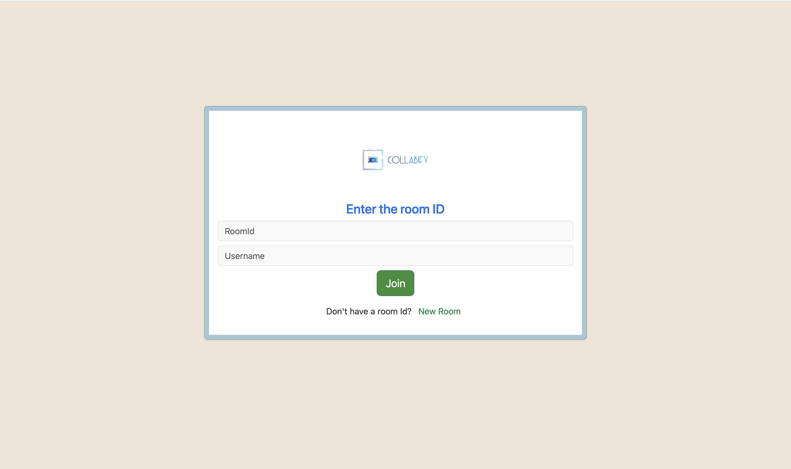
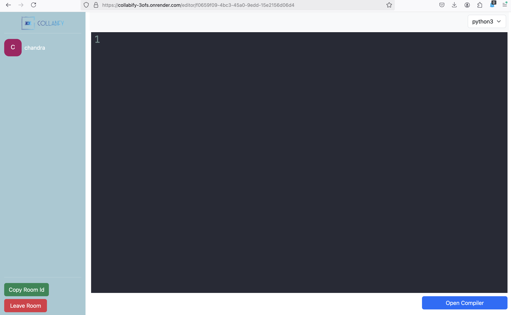
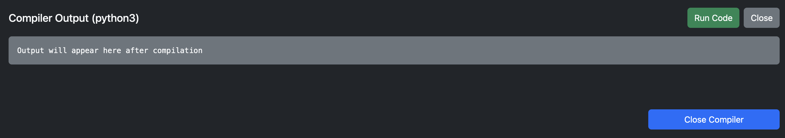
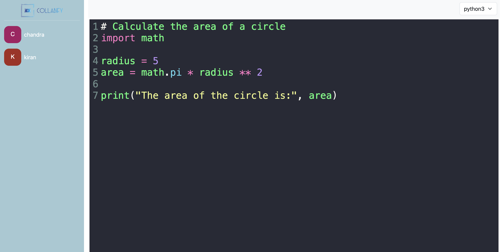
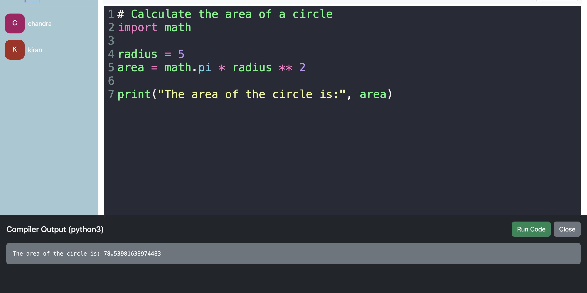

# Multi-User Real-Time Code Collaboration Tool

## Overview

This project is a full-stack application designed to provide real-time collaborative coding experiences. The application features a React frontend and an Express backend, using WebSockets and Socket.IO to enable seamless live editing and code sharing among multiple users. The tool also supports code compilation and output display for supported programming languages.

---

## Key Features

1. **Room Page**:
   - Generate a random UUID for room identification.
   - Enter a name and join a specific room.

2. **Code Editor Page**:
   - Select programming languages.
   - Write code and compile using the "Compile Code" button.
   - View compilation output immediately.
   - Real-time collaboration with multiple users viewing and editing simultaneously.

3. **Real-Time Updates**:
   - Implemented using Socket.IO for bidirectional communication.

4. **Express Backend**:
   - Tracks active users and their respective rooms.
   - Manages real-time synchronization and room states.

5. **Code Editor**:
   - Integrated using CodeMirror for a rich and responsive editing experience.

---

## Tech Stack

### Frontend
- **React**: A JavaScript library for building user interfaces.
- **React Router DOM**: For routing between pages.
- **CodeMirror**: Syntax highlighting and rich code editing.
- **React Hot Toast**: Notifications and alerts.
- **Bootstrap**: Responsive design and UI components.

### Backend
- **Express**: Lightweight Node.js framework for building APIs.
- **Socket.IO**: Enables real-time, bidirectional event-based communication.
- **UUID**: For generating unique room identifiers.

### Other Libraries
- **Axios**: For HTTP requests.
- **dotenv**: For environment variable management.

---

## Project Setup

### Prerequisites
- Node.js and npm installed.
- Clone the repository and navigate to the project directory.

### Installation
1. Install dependencies:
   ```bash
   npm install
   ```

2. Create a `.env` file and configure your environment variables:
   ```env
   PORT=5000
   REACT_APP_BACKEND_URL=http://localhost:5000
   ```

3. Start the backend server:
   ```bash
   nodemon server.js
   ```

4. Start the React frontend:
   ```bash
   npm start
   ```

---

## Architecture

The architecture follows a client-server model:

1. **Frontend**:
   - Manages the UI and user interactions.
   - Connects to the backend via WebSockets for real-time updates.

2. **Backend**:
   - Maintains the state of active rooms and users.
   - Handles real-time communication using Socket.IO.

3. **Socket.IO**:
   - Facilitates communication between clients and the server for broadcasting changes to all users in a room.

### Diagram
Below is a simplified architecture diagram:

```
+---------------+      WebSocket       +------------------+
|               |  (Real-Time Updates) |                  |
|    Client 1   +<-------------------->+  Express Server  |
|               |                      |  (Socket.IO)     |
+---------------+                      +------------------+
       ^                                        |
       | HTTP                                   |
       | (REST API for Compilation)            v
+---------------+                      +------------------+
|               |                      |                  |
|    Client 2   +<-------------------->+  JDoodle API     |
|               |                      | (Code Execution) |
+---------------+                      +------------------+
       ^
       |
       | WebSocket
+---------------+
|               |
|    Client N   |
|               |
+---------------+

```

---

## Screenshots

### Room Page


### Code Editor Page


### Compiler


### Code Execution



---

## Demo Video

[Watch the demo video here](demo-video.mov)

---

## Demo Video

You can access the live version of the application here: https://collabify-3ofs.onrender.com/

---

## Contributing
1. Fork the repository.
2. Create a new branch.
3. Commit your changes.
4. Push the branch and create a pull request.

---

## License
This project is licensed under the MIT License.

---

## Contact
For any questions or suggestions, feel free to open an issue or contact us.
